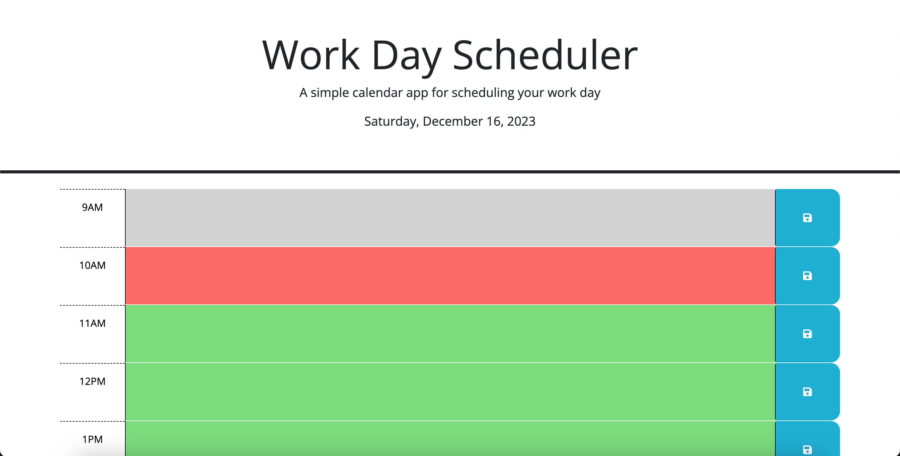
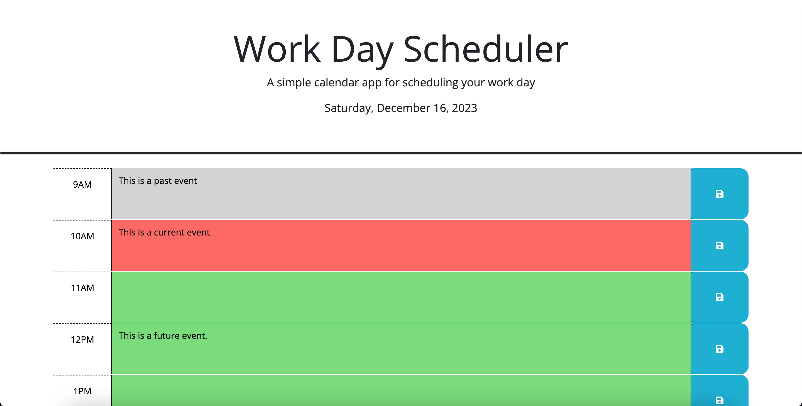

# Challenge 05: Third-Party APIs Work Day Scheduler

For this challenge, we were given starter code for the HTML, CSS, and partial Javascript for a work day scheduler page. Utilizing Dayjs, I had to add Javascript for displaying the current date, giving each time block a certain CSS property depending on the time of day, and use local storage for saving an event to the selected time block. Here was the User Story and Acceptance Criteria.

## User Story

```
AS AN employee with a busy schedule
I WANT to add important events to a daily planner
SO THAT I can manage my time effectively
```

## Acceptance Criteria

```
GIVEN I am using a daily planner to create a schedule
WHEN I open the planner
THEN the current day is displayed at the top of the calendar
WHEN I scroll down
THEN I am presented with timeblocks for standard business hours of 9am&ndash;5pm
WHEN I view the timeblocks for that day
THEN each timeblock is color coded to indicate whether it is in the past, present, or future
WHEN I click into a timeblock
THEN I can enter an event
WHEN I click the save button for that timeblock
THEN the text for that event is saved in local storage
WHEN I refresh the page
THEN the saved events persist
```

## Screenshots of Application

Landing page

Once events have been added


## URL of Deployed Page

https://ashpfander.github.io/work-day-scheduler/